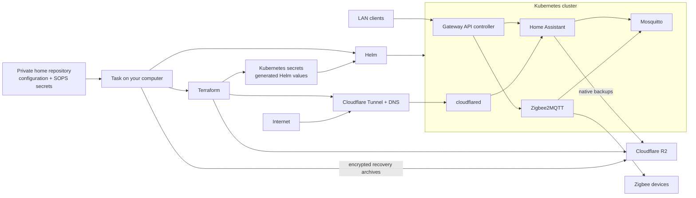

# Domotic

Domotic runs Home Assistant, Zigbee2MQTT, Mosquitto, and Cloudflare Tunnel on
Kubernetes. It supports any Kubernetes distribution with Gateway API. This
repository includes specific k3s instructions because k3s is a common,
lightweight choice for a home server; k3s is not a requirement.

The production workflow gives you:

- local HTTP routes for Home Assistant and Zigbee2MQTT, with the k3s guide
  advertising the default `.local` names through Avahi;
- optional remote Home Assistant access through Cloudflare Tunnel;
- protected Zigbee network keys, PAN ID, and channel;
- native Home Assistant backups and encrypted recovery archives in Cloudflare
  R2;
- automated setup for the Home Assistant owner, MQTT, URLs, and R2 backups;
- a private, version-controlled home configuration with SOPS-encrypted
  credentials; and
- a restore mode for importing an existing native Home Assistant backup.

## How it fits together



`task deploy` runs both Terraform and Helm. Terraform reconciles Cloudflare,
R2, protected Zigbee settings, and the Kubernetes secrets and values needed by
the applications. Helm then reconciles the workloads in the cluster. You do
not run either layer once and forget it; the Task commands keep both layers in
the expected state.

The applications have distinct roles:

| Component | Purpose | Exposure |
| --- | --- | --- |
| Home Assistant | User interface, automations, integrations, and native backups | LAN and, when configured, Cloudflare Tunnel |
| Zigbee2MQTT | Zigbee coordinator and device management | LAN |
| Mosquitto | MQTT transport between Home Assistant and Zigbee2MQTT | Internal to the cluster |
| cloudflared | Outbound connection to the managed Cloudflare tunnel | Not directly exposed |
| Gateway controller | Entry point for local HTTP routes | LAN listener |

Important data lives in several places:

| Data | Location |
| --- | --- |
| Home configuration | Your private Git repository |
| Cloudflare token and initial Home Assistant password | SOPS-encrypted file in that repository |
| Terraform state | Kubernetes Secret in the configured state namespace |
| Home Assistant, Zigbee2MQTT, and Mosquitto data | Persistent volumes on the server |
| Native Home Assistant backups | Cloudflare R2 when enabled |
| Deployment recovery archives | Locally encrypted, then uploaded to Cloudflare R2 |

Because Terraform state is stored in the cluster, back it up or run the
matching destroy operation before intentionally rebuilding the cluster. This
prevents external Cloudflare resources from becoming orphaned.

## Supported Kubernetes environments

Domotic supports any Kubernetes distribution with Gateway API. The included
k3s guide provides one complete home-server setup, but the Terraform and Helm
workflow is not tied to k3s.

## Production installation

The short path is below. [The private deployment guide](PRIVATE_DEPLOYMENT.md)
explains upgrades, restore behavior, and the security boundaries in more
detail.

### 1. Install the workstation tools

Install these on the computer from which you will operate the server:

- `kubectl`
- Terraform 1.7 or newer
- Helm 3 or newer
- Git
- `jq`
- [SOPS](https://getsops.io/docs/)
- [Task](https://taskfile.dev/docs/installation)

Repository backups also require `age` and the AWS CLI. On macOS, Task and SOPS
are available through Homebrew:

```sh
brew install go-task sops
```

You also need a Cloudflare account with a managed domain and a supported
Zigbee adapter.

### 2. Create a private deployment repository

This repository contains the reusable software. Create a separate private
repository for your home's settings and encrypted credentials:

```sh
mkdir home-deployment
cd home-deployment

DOMOTIC_REF="$(git ls-remote https://github.com/fiam/domotic.git \
  refs/heads/main | awk '{print $1}')"

task --taskfile \
  "https://github.com/fiam/domotic.git//Taskfile.remote.yml?ref=${DOMOTIC_REF}" \
  init DOMOTIC_REF="$DOMOTIC_REF"
```

Task asks you to approve the downloaded Taskfile the first time. Check the
repository URL before accepting it. The generated `Taskfile.yml` records the
exact Domotic version used by your home.

### 3. Connect a Kubernetes cluster

Set `KUBE_CONTEXT` in the private `Taskfile.yml` to an existing kubeconfig
context and verify it:

```sh
kubectl --context=your-context get nodes
```

For a single-machine k3s server, follow [the k3s host guide](DEPLOYMENT.md). It
installs k3s, configures its packaged Traefik controller, publishes the local
names with Avahi, and provides this convenience command for importing the
server kubeconfig:

```sh
task k3s:context \
  SSH_USER=your-server-user \
  SSH_HOST=your-server-hostname.local

kubectl --context=domotic get nodes
```

The SSH command opens a terminal so `sudo` can ask for the server password. It
is only needed for the documented k3s setup; other clusters can use their
normal kubeconfig workflow.

### 4. Encrypt the deployment credentials

Configure SOPS with the key backend you want to use. Domotic does not create
or store that key. Then create the encrypted secrets file:

```sh
cp config/secrets.yaml.example config/secrets.yaml
chmod 0600 config/secrets.yaml
${EDITOR:-vi} config/secrets.yaml
sops encrypt --filename-override config/secrets.sops.yaml \
  < config/secrets.yaml > config/secrets.sops.yaml
rm config/secrets.yaml

git add config/secrets.sops.yaml
task secrets:check
```

The file contains:

```yaml
CLOUDFLARE_API_TOKEN: your-account-api-token
HOMEASSISTANT_ADMIN_PASSWORD: your-initial-owner-password
```

Use `task secrets:edit` to change it later. SOPS can use age, PGP, cloud KMS,
or any other backend it supports; key discovery is entirely standard SOPS
behavior.

### 5. Configure, validate, and deploy

Edit these files in the private repository:

- `config/infra/terraform.tfvars`: Cloudflare account and domain, tunnel and R2
  names, local hostnames, and protected Zigbee settings;
- `config/values.yaml`: Zigbee adapter, storage, resources, and application
  settings.

For a new Home Assistant installation, keep:

```hcl
homeassistant_bootstrap_mode = "seed"
```

Then validate and deploy:

```sh
task secrets:check
task check
task plan
task deploy
task status
```

Review the Terraform plan before applying it. After the deployment is healthy,
commit the private repository so its exact configuration and encrypted secrets
can be recovered:

```sh
git add .
git commit -m "chore: configure home deployment"
git remote add origin <private-repository-url>
git push -u origin main
```

### 6. Access the services

After pointing local DNS or mDNS at the cluster's Gateway, the default names
are:

- Home Assistant: `http://homeassistant.local`
- Zigbee2MQTT: `http://zigbee2mqtt.local`
- Remote Home Assistant: the Cloudflare hostname selected in
  `config/infra/terraform.tfvars`

### 7. Configure backups

Terraform can create a protected R2 bucket and configure Home Assistant to make
daily encrypted native backups. A separate Task workflow backs up Terraform
state, Zigbee identity, and the Kubernetes recovery secrets.

Follow [the backup guide](BACKUP.md) before running:

```sh
cp config/backup.env.example config/backup.env
chmod 0600 config/backup.env
task backup
task backup:list
```

Keep the Home Assistant emergency-kit key, the SOPS key, and the recovery
archive's age identity somewhere outside the server and R2 bucket.

## Everyday commands

Run these from the private repository:

| Command | Purpose |
| --- | --- |
| `task secrets:edit` | Edit the SOPS-encrypted credentials. |
| `task check` | Validate the selected Domotic version and private configuration. |
| `task plan` | Preview Terraform changes. |
| `task deploy` | Reconcile Terraform resources and Kubernetes workloads. |
| `task status` | Show the Helm release and workloads. |
| `task keys:capture` | Refresh the portable Zigbee identity file. |
| `task backup` | Upload an encrypted deployment recovery archive. |
| `task backup:list` | List recovery archives in R2. |
| `task restore:plan` | Preview preparation for a native Home Assistant restore. |
| `task restore` | Start a blank Home Assistant instance in native restore mode. |

## Restore an existing Home Assistant backup

Do not seed a new owner before importing a native backup. Run:

```sh
task restore:plan
task restore
```

Open Home Assistant and choose **Upload backup**. After the restore finishes,
put the password of an owner from the restored system in
`config/secrets.sops.yaml`, then use the normal `task deploy` workflow again.
The restore tasks require the Cloudflare token but do not require or inject the
initial Home Assistant password.

## Protect the Zigbee network identity

The Zigbee network key, extended PAN ID, PAN ID, and channel identify the
existing network. Losing or changing them can require pairing every device
again.

Terraform records the live identity in the ignored
`config/infra/zigbee-keys.tfvars.json` file and blocks accidental changes.
Refresh and back it up after a successful deployment:

```sh
task keys:capture
task backup
```

Only set `force_update_secrets = true` when you deliberately intend to create
a different Zigbee network and accept re-pairing the devices. Recovery details
are in [the backup guide](BACKUP.md).

## Custom Home Assistant integrations

Domotic installs no custom integration by default. A private deployment can
provide a repository-local integration or a checksum-pinned public archive.
See [CUSTOM_INTEGRATIONS.md](CUSTOM_INTEGRATIONS.md) for configuration, upgrade,
and removal instructions.

## Upgrading

The private repository pins Domotic with `DOMOTIC_REF`. To upgrade:

1. Make both the native Home Assistant backup and deployment recovery archive.
2. Review the new Domotic commit and
   [HOME_ASSISTANT_COMPATIBILITY.md](HOME_ASSISTANT_COMPATIBILITY.md).
3. Change `DOMOTIC_REF` in the private `Taskfile.yml`.
4. Run `task check`, `task plan`, `task deploy`, and `task status`.
5. Commit the new pin after Home Assistant, MQTT, Zigbee, routes, and backups
   are healthy.

Home Assistant setup uses version-coupled onboarding and configuration APIs.
Every Home Assistant version change must follow the compatibility audit and
fresh-cluster test described in that document.

## Development with Kind

Clone this public repository when changing Terraform, charts, or scripts:

```sh
git clone https://github.com/fiam/domotic.git
cd domotic
task check
```

The development environment uses Kind, an NGINX Gateway, and a Zigbee
coordinator emulator. It is separate from the production cluster workflow. Copy
`infra/terraform.tfvars.example` to the ignored `infra/terraform.tfvars` and
configure disposable Cloudflare and Home Assistant values before deploying:

```sh
task deploy-dev
task dev:hosts:install
task dev:status
```

When using Colima or testing devices on the physical LAN, follow
[DEVELOPMENT_NETWORKING.md](DEVELOPMENT_NETWORKING.md). Terraform state for the
development deployment lives inside Kind, so destroy Terraform-managed
Cloudflare resources before deleting the cluster:

```sh
task destroy-dev
task dev:hosts:remove
```

## Documentation

| Guide | Use it for |
| --- | --- |
| [DEPLOYMENT.md](DEPLOYMENT.md) | Reference installation for a single-node k3s home server |
| [PRIVATE_DEPLOYMENT.md](PRIVATE_DEPLOYMENT.md) | Maintaining a long-lived private home repository |
| [BACKUP.md](BACKUP.md) | R2, native Home Assistant backups, and deployment recovery |
| [CUSTOM_INTEGRATIONS.md](CUSTOM_INTEGRATIONS.md) | Adding user-selected Home Assistant integrations |
| [DEVELOPMENT_NETWORKING.md](DEVELOPMENT_NETWORKING.md) | Kind, Colima, and access to LAN devices |
| [HOME_ASSISTANT_COMPATIBILITY.md](HOME_ASSISTANT_COMPATIBILITY.md) | Auditing version-coupled Home Assistant automation |
| [infra/README.md](infra/README.md) | Terraform inputs, outputs, and component tasks |

## Contributing

- Never commit real Terraform variables, plaintext credentials, generated
  Helm values, or Zigbee identity files.
- Run `task check` before committing.
- Test Home Assistant version changes on a new Kind volume and update the
  compatibility record.
- Use the example configuration files rather than personal deployment data in
  tests and documentation.
